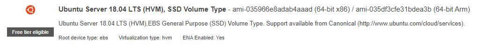
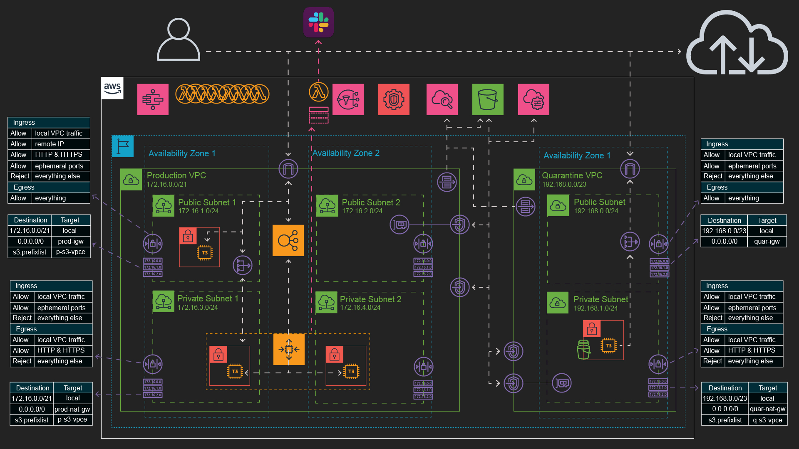
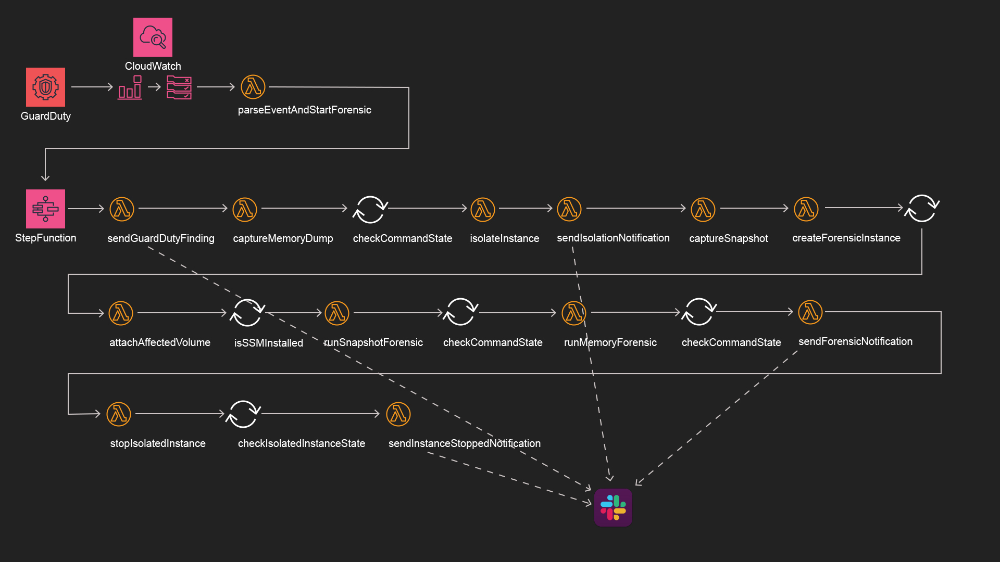
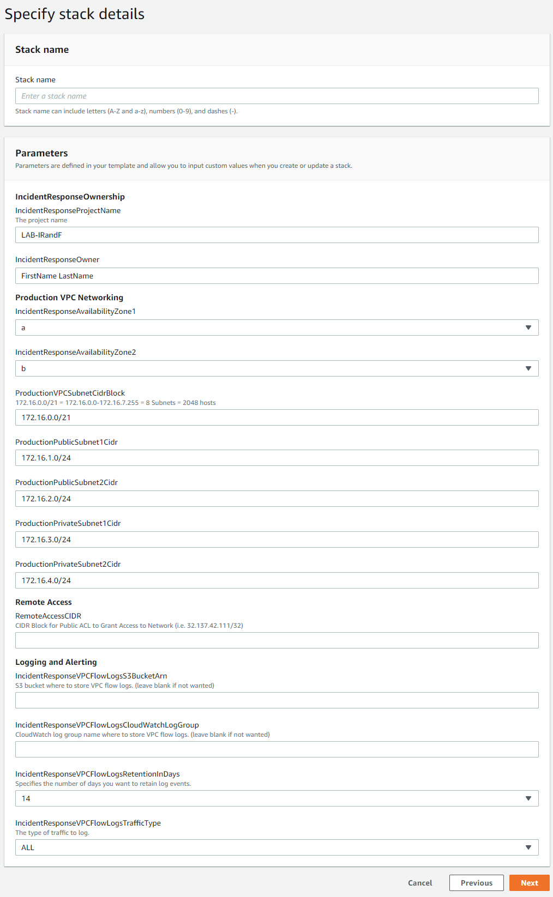
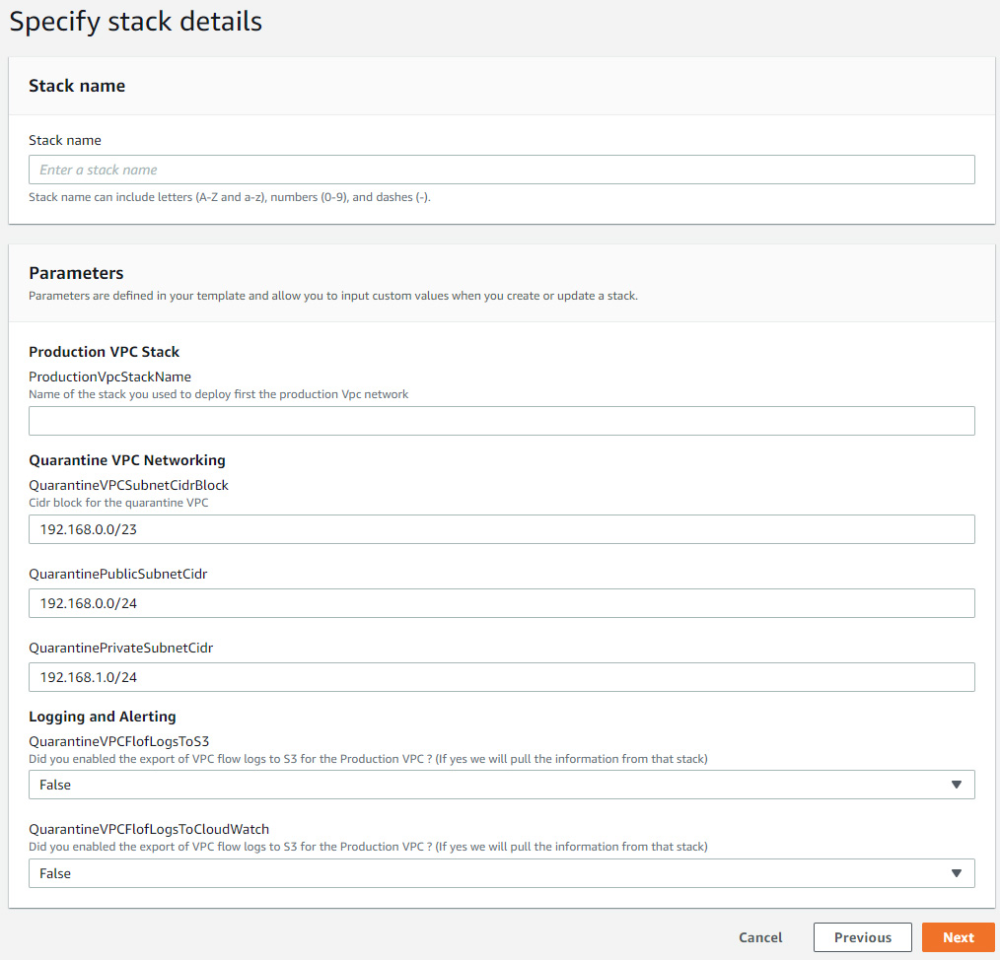
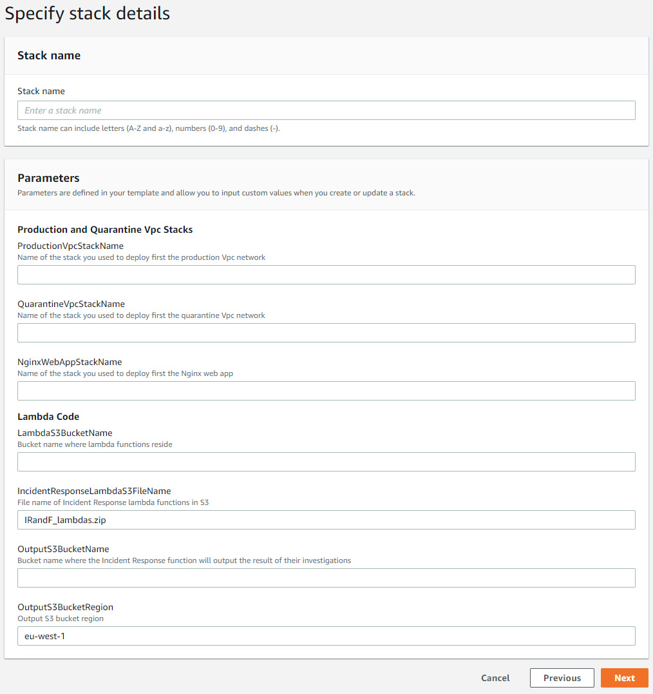

# Automated Incident Response and Forensic on AWS
This is an example of an automated incident response and forensic analysis on AWS using AWS GuardDuty, a StepFunction and Lambda functions. The CloudFormation template and code in this repository aim at providing everything to:
* trigger improper security behavior on a web application server, 
* see the event picked-up by GuardDuty
* execute as a response a StepFunction which will control an entire incident response and forensic workflow (details below)
* see the web application auto-heal from the incident
* receive basic snapshot and memory forensic analysis together with all the data to conduct deeper forensic analysis post-incident

# Credits
* This demo is primarily based on the demo released by Ben Potter at AWS Summit London 2018: https://www.youtube.com/watch?v=f_EcwmmXkXk
* The code of his demo is available here : https://github.com/awslabs/aws-security-automation/tree/master/EC2%20Auto%20Clean%20Room%20Forensics
* I also reused and modified a VPC CloudFormation template released by Levon Becker for Stelligent available here: https://github.com/stelligent/cloudformation_templates/blob/master/infrastructure/vpc.yml
* I also reused shell scripts published by Ryan Holland and Oliver Cahagne hon AWS Labs to simulate security breaches to test GuardDuty: https://github.com/awslabs/amazon-guardduty-tester/blob/master/guardduty_tester.sh

# Pre-requisties
* Activate AWS GuardDuty on your AWS account
* Have a Slack channel ready. Alerts will be sent to that channel
* Download the two Lambda functions ZIP code and save them into one of your S3 bucket
  * one is for the function sending auto scaling notifications to the Slack channel
  * the other one contains the code of all the incident response and forensic Lambda functions
* Create SSH Key Pairs for your EC2 instances (In the __EC2 console__, go to __Network & Security__ > __Key Pairs__). The same key will be installed on all instances (bastion host and Nginx web app instances). Extract the private key from the key pair in the OpenSSH format.
* If you choose to enable VPC Flow Logs to S3, have a bucket ready for it
* Prepare a S3 bucket where the outputs of the forensic analysis will be stored
* Check the AMI name in your region of the Ubuntu Server 18.04 LTS 

# The demo envrionment
This is the environment deployed by the 4 CloudFormation templates proposed here:
1. The production VPC 
2. The Quarantine VPC
3. The Nginx web application server
4. The incident response and forensic analysis StepFunction and Lambda functions

See for the explanation video: https://youtu.be/tUGf4uHOhCA

# The incident response and forensic analysis workflow 
This diagram represents the entire workflow deployed using the last CloudFormation template which uses a StepFunction and Lambda functions to perform the entire incident response and forensic analysis:
* notifying the administrators of the incident and the steps taken
* taking memory dump and EC2 instance snapshot
* installing a forensic instance
* performing memory snapshot and memory dump analysis
* exporting all data collected to S3
* stopping the misbehaving instance

Look at this video for the detailed explanation and the demo: https://youtu.be/Uis8vmlr_WI

# Deploying the Demo
## Step 1: deploy Private VPC template
* Deploy the __Production-VPC-template.yaml__ template
* Give a name to the deployment stack. You'll need to give that name as an input parameter for later templates
* You can choose to enable VPC Flow Logs to S3 and/or CloudWatch Logs
* Give your public IP to allow remote SSH in the public subnets ACLs and the bastion host NSG. You will need this and the bastion host to SSH into one of the Nginx instance and execute one of the script simulating an improper security behavior 

## Step 2: deploy Nginx web app template
* Deploy the __NginxWebApp-template.yaml__ template
* Give a name to the deployment stack. You'll need to give that name as an input parameter for last template
* Provide the stack name used to deploy the Production VPC template

Note: steps 2 and 3 can be inverted/performed simultaneously since they  do not depend on each other.
## Step 3: deploy Quarantine VPC template
* Deploy the __Quarantine-VPC-template.yaml__ template
* Give a name to the deployment stack. You'll need to give that name as an input parameter for the last template
* Provide the stack name used to deploy the Production VPC template

## Step 4: deploy Forensic template
* Deploy the __Forensic-template.yaml__ template
* Provide the stack names used to deploy the Production VPC template, the Quarantine VPC template and the NGinx web app template

# Triggering the incident response and forensic
## Automatic trigger
1. SSH into the bastion host (granted you provided your public IP to the first template to allow SSH into the ACL and NSG)
2. In the bastion host, in the ubuntu user's __~/.ssh__ folder create and __id_rsa__ file and copy paste into it your key pair's private key in the OpenSSH format.
3. From there SSH into one of the two NginxWebApp instance
4. go into the __/tmp/attack__ folder
5. Launch one of the 3 script generating an improper security behavior:
   * __bitcoin-attack.sh__
   * __dns-exfiltration-attack.sh__
   * __backdoor-attack.sh__
Note: Don't worry if the process is not triggered immediatley after launching one of these scripts. It takes at least 30 minutes for the incident to be reported by GuardDuty. And once reported it takes about 5 minutes for the CloudWatch Events Rule to pickup the event and trigger the Lambda function which will parse the event and launch the incident response and forensic StepFunction.
## Manual trigger
1. Copy the provided __guard-duty-event.json__ file
2. Replace the instance ID __i-0011222aa333333b4__ by one of the NginxWebApp instance ID
3. Open the __\<your project name\>\_sec-ir-0-parseEventAndStartForensic__ Lambda function
4. create a test with the JSON content and run it
# Disclaimer
The code provided in the Lambda functions performing the incident response and forensic analysis is written for Ubuntu Server 18.04 LTS. If you choose a different Linux distribution, you will have to update at the minimum:
* the code in the NginxWebApp-template.yaml file, used to deploy and configure Nginx on the EC2 instance after launch
* the code in the captureMemoryDumpForForensic.py Lambda function to install LiME on the instance and perform the memory dump
* the code in the createForensicInstance.py to create the forensic instance in the Quarantine VPC and install all the tools (e.g. sleuthkit, vloatility...) to perform forensic analysis
* the code in the runSnapshotForensicAnalysis.py to launch commands using Systems Manager to perform the snapshot's forensic analysis
* the code in the runMemoryForensicAnalysis.py to launch commands using Systems Manager to perform the memory dump forensic analysis
